<!-- 1. HERO — terminal profile with animated load -->

  <picture>
    <source media="(prefers-color-scheme: dark)" srcset="./dark.svg" />
    <source media="(prefers-color-scheme: light)" srcset="./light.svg" />
    
  </picture>

<!-- 2. STREAK -->

  

<!-- 3. STATS + LANGUAGES -->
 

  
  

<!-- 4. CONTRIBUTION SNAKE -->
 

  <picture>
    <source media="(prefers-color-scheme: dark)" srcset="./snake/snake-dark.svg" />
    <source media="(prefers-color-scheme: light)" srcset="./snake/snake-light.svg" />
    
  </picture>

<!-- 5. PLATFORM (high-level cloud / technical modules — replaces empty 3D placeholder) -->
 

  

<!-- 6. EXPERIENCE -->
 

  

<!-- 7. SKILLS -->
 

  

<!-- 8. LINKS -->
 

  
  &nbsp;
  
  &nbsp;
  
  &nbsp;
  

