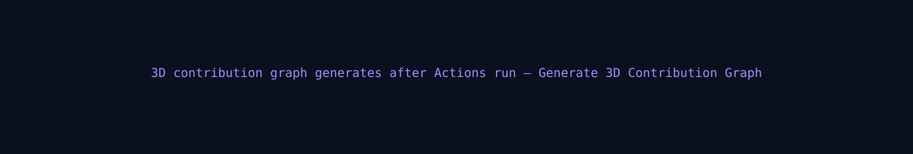
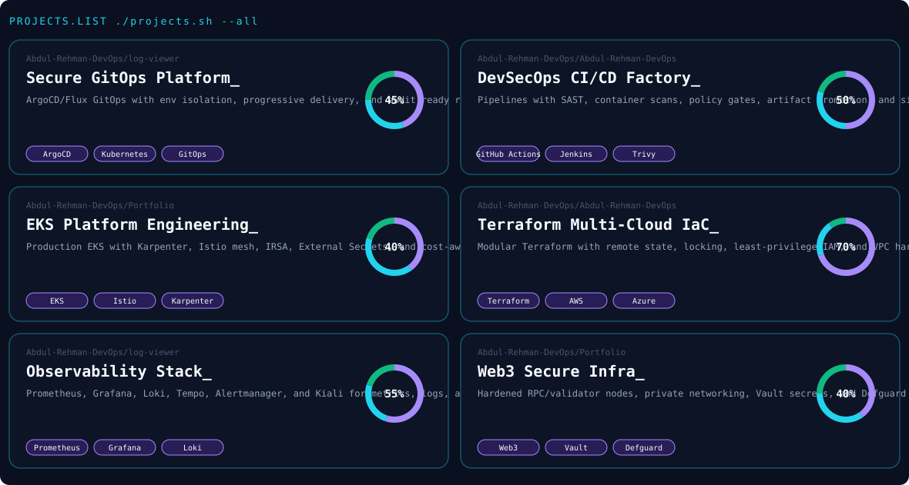

<!-- ===== THEME-AWARE HERO BANNER (exact terminal card from reference style) ===== -->

  <picture>
    <source media="(prefers-color-scheme: dark)" srcset="./dark.svg" />
    <source media="(prefers-color-scheme: light)" srcset="./light.svg" />
    
  </picture>

<!-- ===== STREAK + STATS ===== -->

<picture>
  <source media="(prefers-color-scheme: dark)" srcset="https://streak-stats.demolab.com/?user=Abdul-Rehman-DevOps&hide_border=true&background=0A101F&stroke=22D3EE&ring=A78BFA&fire=10B981&currStreakLabel=22D3EE&sideLabels=94A3B8&currStreakNum=F8FAFC&sideNums=F8FAFC&dates=64748B&titleColor=22D3EE&card_width=1180" />
  
</picture>

 

<!-- ===== 3D CONTRIBUTION GRAPH (animated isometric blocks like reference) ===== -->
 

  <picture>
    <source media="(prefers-color-scheme: dark)" srcset="./profile-3d-contrib/profile-night-rainbow.svg" />
    <source media="(prefers-color-scheme: light)" srcset="./profile-3d-contrib/profile-green-animate.svg" />
    
  </picture>

<!-- ===== CONTRIBUTION SNAKE ===== -->
 

  <picture>
    <source media="(prefers-color-scheme: dark)" srcset="./snake/snake-dark.svg" />
    <source media="(prefers-color-scheme: light)" srcset="./snake/snake-light.svg" />
    
  </picture>

<!-- ===== PROJECTS PANEL ===== -->
 

  

<!-- ===== SOCIAL ===== -->
 

&nbsp;

&nbsp;

&nbsp;

&nbsp;

