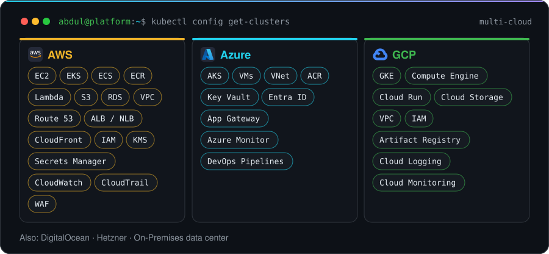

<!--
  Profile README. Cards in ./cards are generated by .github/scripts/cards.py
  (edit the DATA block there, then run it). Streak + snake are refreshed by the
  "Profile Assets" workflow every 12 hours.
-->

<picture>
  <source media="(prefers-color-scheme: dark)" srcset="./cards/hero-dark.svg" />
  <source media="(prefers-color-scheme: light)" srcset="./cards/hero-light.svg" />
  
</picture>

  
  
  
  
  

<picture>
  <source media="(prefers-color-scheme: dark)" srcset="./cards/impact-dark.svg" />
  <source media="(prefers-color-scheme: light)" srcset="./cards/impact-light.svg" />
  
</picture>

### 👋 About me

- 🏢 **Senior DevOps / DevSecOps Engineer** at **Funavry Technologies**, running **3–5 production Kubernetes clusters** across **EKS, AKS and GKE**
- ☁️ **4+ years** taking teams from manual servers to automated, secure platforms on **AWS, Azure and GCP**, for **AI/GPU**, **SaaS** and **Web3** workloads
- 🔁 Everything in code: **Terraform**, **GitOps (ArgoCD · FluxCD)**, **Helm**, with **shift-left security** gating every pipeline
- 💬 Ask me about **Kubernetes autoscaling (KEDA · Karpenter)**, **GitOps**, **DevSecOps pipelines** and **production incident RCA**
- 📫 **Open to full-time roles (remote or Islamabad) and freelance work**: [abdulrehman.devops@gmail.com](mailto:abdulrehman.devops@gmail.com)

<picture>
  <source media="(prefers-color-scheme: dark)" srcset="./cards/experience-dark.svg" />
  <source media="(prefers-color-scheme: light)" srcset="./cards/experience-light.svg" />
  
</picture>

<picture>
  <source media="(prefers-color-scheme: dark)" srcset="./cards/clouds-dark.svg" />
  <source media="(prefers-color-scheme: light)" srcset="./cards/clouds-light.svg" />
  
</picture>

<picture>
  <source media="(prefers-color-scheme: dark)" srcset="./cards/toolbox-dark.svg" />
  <source media="(prefers-color-scheme: light)" srcset="./cards/toolbox-light.svg" />
  
</picture>

  <picture>
    <source media="(prefers-color-scheme: dark)" srcset="https://skillicons.dev/icons?i=aws%2Cazure%2Cgcp%2Ckubernetes%2Cdocker%2Cterraform%2Cansible%2Cgithubactions%2Cgitlab%2Cjenkins%2Cprometheus%2Cgrafana&theme=dark&perline=14" />
    <source media="(prefers-color-scheme: light)" srcset="https://skillicons.dev/icons?i=aws%2Cazure%2Cgcp%2Ckubernetes%2Cdocker%2Cterraform%2Cansible%2Cgithubactions%2Cgitlab%2Cjenkins%2Cprometheus%2Cgrafana&theme=light&perline=14" />
    
  </picture>
   
  <picture>
    <source media="(prefers-color-scheme: dark)" srcset="https://skillicons.dev/icons?i=linux%2Credhat%2Cubuntu%2Cnginx%2Ccloudflare%2Cgo%2Cpy%2Cbash%2Cpostgres%2Credis%2Ckafka%2Celasticsearch%2Cgit%2Cgithub&theme=dark&perline=14" />
    <source media="(prefers-color-scheme: light)" srcset="https://skillicons.dev/icons?i=linux%2Credhat%2Cubuntu%2Cnginx%2Ccloudflare%2Cgo%2Cpy%2Cbash%2Cpostgres%2Credis%2Ckafka%2Celasticsearch%2Cgit%2Cgithub&theme=light&perline=14" />
    
  </picture>

### ⚡ Featured

| Project | What it does | Stack |
|:--|:--|:--|
| [**log-viewer**](https://github.com/Abdul-Rehman-DevOps/log-viewer) | Kubernetes-native log viewer: live multi-pod streams, CrashLoopBackOff / ImagePullBackOff detection, RBAC-scoped access. Logs never leave the cluster. | Go · Kubernetes API · Helm · Docker |
| [**Portfolio**](https://github.com/Abdul-Rehman-DevOps/Portfolio) | Source of [abdulrehman.cz](https://www.abdulrehman.cz): experience, platform workstreams, interactive terminal, contact form. | Next.js · TypeScript · Tailwind · Netlify |

### 🎓 Certifications & training

AWS Technical Essentials — *Amazon Web Services* · DevOps Certification — *Intellipaat* · Microsoft Azure Certification — *Intellipaat*

### 📈 Activity

<picture>
  <source media="(prefers-color-scheme: dark)" srcset="./streak/streak-dark.svg" />
  <source media="(prefers-color-scheme: light)" srcset="./streak/streak-light.svg" />
  
</picture>

<picture>
  <source media="(prefers-color-scheme: dark)" srcset="./snake/snake-dark.svg" />
  <source media="(prefers-color-scheme: light)" srcset="./snake/snake-light.svg" />
  
</picture>

Cards are generated from code in <code>.github/scripts</code> and refreshed by GitHub Actions every 12 hours.

